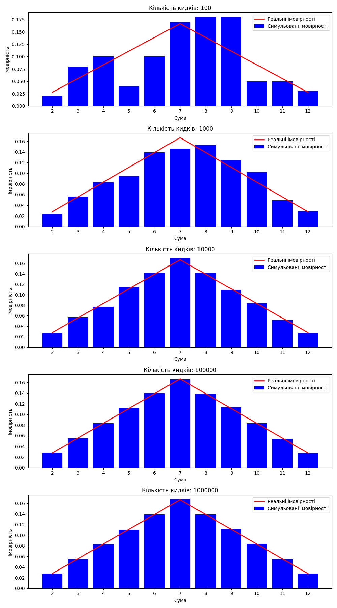

## Аналіз результатів

На графіках нижчке представлено результати експериментів з симуляції кидків двох кубиків при різній кількості спроб: від 100 до 1,000,000. Червона лінія показує теоретичні імовірності випадіння кожної можливої суми чисел на двох кубиках, а сині стовпці відображають імовірності, отримані в результаті симуляції.

### Висновок

З графіків видно, що зі збільшенням кількості кидків точність симуляції зростає, і симульовані імовірності наближаються до теоретичних значень. При малій кількості кидків (100, 1000) спостерігається значна варіативність результатів, що свідчить про високий рівень випадковості. Однак, починаючи з 10,000 кидків, симульовані імовірності стають значно ближчими до теоретичних, а при 1,000,000 кидків майже ідеально відтворюють теоретичний розподіл імовірностей.
